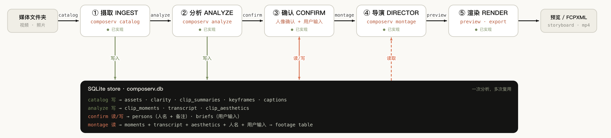

# composerV

**English** · [中文](README.zh-CN.md)

[](https://github.com/qtwhat/composerV/actions/workflows/ci.yml)
[](https://qtwhat.github.io/composerV/index.en.html)
[](LICENSE)


> **▶ See the interactive pipeline overview:** [qtwhat.github.io/composerV](https://qtwhat.github.io/composerV/index.en.html). Click any stage for its internals. The `index.html` in this repo is just the source; the link renders it.

A local-first, **story-first** assistant for turning a large personal video archive
(GoPro / phone, hundreds of GB) into a story you believe in, then handing it off to
Final Cut Pro for finishing.

The hard, valuable part is **helping you think the story**, not search and not format
conversion. Everything below the story layer exists to serve it.

## Architecture at a glance



Five stages on one line, all revolving around a single SQLite **store**
(`composerv.db`). The slow perception work (a VLM watching the frames, Whisper
listening to the audio, on-device aesthetic scoring) **runs once and writes the
store**; the director only ever **reads that cache**, so making a cut and revising it
both stay fast. The interactive version of this diagram (click a stage for its
internals) is live at **[qtwhat.github.io/composerV](https://qtwhat.github.io/composerV/index.en.html)**
(source: [`index.en.html`](index.en.html)).

## The idea in one line

Turn video into **semantics + metadata** so an LLM can help you *curate* (dedupe, pace,
vary, select for narrative fit), not just attribute-match. You author the story spine;
the AI fills the beats; a **zero-render live preview** reflects every edit instantly;
the locked story compiles to FCPXML for Final Cut.

## Architecture (three layers)

- **`index/`** (substrate): scan → CFR 720p proxies + frame sampling (with true source
  PTS) → VLM captions / objects / OCR / shot type / WhisperX transcript / insightface
  faces / GPS+time / emotion+quality signals → SQLite + sqlite-vec + per-clip sidecars
  → a 3-tier "Archive Brief" an LLM can reason over.
- **`story/`** (the product): human authors the spine (controlling idea + target
  feeling); the AI proposes a structure and fills beats with candidate moments ranked by
  narrative importance (not "exciting-ness"); `compile(Story) → IntentionList`.
- **`render/`** (output): one IntentionList, three targets: a live **AVComposition**
  preview (zero render), a hand-rolled **FCPXML 1.13** emitter for Final Cut, and a
  storyboard / optional flattened share copy.

## Pipeline stages and status

The five stages run as one line, `catalog → analyze → confirm → montage → preview`,
each a CLI subcommand reading and writing the shared store:

| Stage | Command | Status | What it does |
|---|---|---|---|
| ① Ingest | `composerv catalog` | ✅ Done | Scan folders → CFR 720p proxies + keyframes → captions / OCR / shot type → store |
| ② Analyze | `composerv analyze` | ✅ Done | Per-frame VLM moments + WhisperX transcript + on-device aesthetics; **slow, runs once, cached** |
| &nbsp;&nbsp;└ Aesthetics | *(inside analyze)* | ✅ Done | Apple Vision on-device quality / emotion scoring; informs the in-point, not the shot selection |
| ③ Confirm | `composerv confirm` | ✅ Done | Face naming + a short user brief → `persons` / `briefs`; the brief is injected as top-priority human guidance |
| ④ Director | `composerv montage` | ✅ Done | One Claude call over a text **footage table** → edit decisions + music intent |
| ⑤ Render | `composerv preview` / `export` | ✅ Done | Zero-render AVComposition preview · FCPXML 1.13 · storyboard / MP4 |
| &nbsp;&nbsp;└ Auto-reframe | *(inside render)* | ✅ Done | Crop vertical clips to fill 16:9, tracking the subject; rights rotated footage upright |
| Music-driven editing | *(direction 3)* | 🔷 Planned | Two-pass reorder so the musical climax lands on the strongest shot; spec reviewed, 10 tasks planned, not built |

Music selection itself is already live: the director emits a `MusicIntent`, a
deterministic `rank_tracks` picks the track, and segments are beat-snapped to the grid.

## Toolchain

Python 3.12 managed by [uv](https://docs.astral.sh/uv/). Heavy ML/platform deps are
optional extras (`analyze-local`, `analyze-api`, `transcribe`, `faces`, `preview`,
`vector`) so the core installs light.

```sh
uv sync                 # core + dev
uv run pytest           # run tests
```

## Try it without your own footage

`composerv demo` generates a fully synthetic demo set (test-pattern clips with
synthesized speech and an OCR-able sign, plus two beat-gridded music tracks with
distinct energy arcs), no downloads, no licenses, no personal media:

```sh
uv run composerv demo ./composerv-demo
# then follow the printed catalog / music index / analyze / montage commands
```

The director (montage) step needs Claude: either the `claude` CLI (a Claude Code
subscription; used automatically when installed) or an Anthropic API key
(`uv sync --extra analyze-api`, then `export ANTHROPIC_API_KEY=...`). Set
`CV_CLAUDE_BACKEND=api` to force the API when both are available. Perception
(analyze) runs fully local and needs neither.

## Configuration (env vars)

| Var | Default | Meaning |
|---|---|---|
| `CV_OUT` | `~/Movies/composerV` | output base (reels, EDL/FCPXML/storyboards) and the default DB location |
| `CV_MUSIC_DIR` | `~/.composerv/music` | the `<feeling>/`-tagged music library |
| `CV_AESTHETICS_BIN` | auto-built | path to the compiled Swift aesthetics scorer |
| `CV_CLAUDE_BACKEND` | CLI when installed | set `api` to force the Anthropic API over the `claude` CLI |
| `CV_CLAUDE_PROXY` | none | HTTP(S) proxy for `claude` CLI calls |

## Contributing

Issues and pull requests are welcome. See [CONTRIBUTING.md](CONTRIBUTING.md) for setup,
tests, and the pull-request checklist, [CODE_OF_CONDUCT.md](CODE_OF_CONDUCT.md) for
community expectations, and [SECURITY.md](SECURITY.md) for reporting vulnerabilities.

## License

MIT (see `LICENSE`). The ML models downloaded at runtime have their own
licenses: notably the insightface face models are **non-commercial research
only**; see `THIRD_PARTY_NOTICES.md` before any commercial use.
